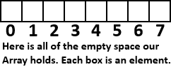
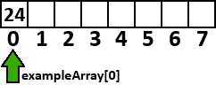
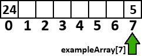

# Arrays
When we have a lot of data to hold, it can be rather intensive to store all the data into separate variables. For example, suppose you had to roll a pair of dice 100 times and store the sum of each roll. You would need to make 100 variables to store it all!

Or do you? With ``array``s, you can condense those 100 potential variables into just 1 variable. How is this possible? well first, let's define what an ``array`` is.
- An ``array`` is a collection of elements, in which each element can be accessed by an index, and doing so allows us to get a value from said ``array``.

That's a rather technical definition, so let's put a face to the jargon:
```c
#include <stdio.h>
#include <stdlib.h>

int main() {

    int exampleArray[8]; // Create an array of 8 elements.

    exampleArray[0] = 24; // Set the first element to 24.

    return 0;
}
```
As seen above, we create an ``array`` called ``exampleArray``. This ``exampleArray`` is of the type ``int``. So that means every element inside of it must be an ``int``:


We then set the first element (referenced using an index of 0) to ``24``:


Notice that the ``array`` starts from ``0`` when referring to positions of elements within the ``array``, even though we defined the size when creating the ``array`` to be ``8``. Keep this in mind when accessing ``array``s! If we tried to access element ``8`` above by doing ``exampleArray[8]``, this is actually NOT correct, because that would be the 9th element, since ``array``s start from position ``0``.

To properly access and set the last element of the ``array``, we can do something like ``exampleArray[7] = 5;``, and that will be fine:


Once we set these values, we can retrieve them at any time by simply doing ``exampleArray[i]`` where ``i`` is the position of the element we want.

Since we can access ``array``s using a variable, that means that ``array``s can be looped over! We can just make an ``int`` variable that increments every loop iteration, and use that to access our ``array``:

```c
#include <stdio.h>
#include <stdlib.h>

int main() {

    int exampleArray[8];

    for(int i = 0; i < 8; i++) {
        exampleArray[i] = 7 - i;
        printf("%d\n", exampleArray[i]);
    }

    return 0;
}
```
Which outputs:
```c
7
6
5
4
3
2
1
0
```
Something to notice about that looping is the condition. Notice that ``i`` is starting from ``0``, and that the ``condition`` is ``i`` must be less than ``8``, which is also the size of our ``array``. Were it ``<=``, we would be using ``8`` to access an ``array`` in which ``7`` is the maximum index you can put into it, which is not good! So be careful with that.

Also some other rules/tips regarding arrays:
- Once you initialize them, you can **not** change their size.
- If you do not set the elements in the ``array`` to a value, they will be full of random numbers. More on why that is in the upcoming tutorials.
- You can have ``array``s of any type.

## Initializing Arrays with Data
If you don't want to loop through an ``array`` just to set all of its values, you can just initialize it like so:

``int array[5] = { 0, 1, 2, 3, 4 }``

In this case, we set elements 1-5 to 0-4, respectively.

## Multi-Dimensional Arrays
You can also have ``array``s of ``array``s. The are known as ``2D array``s or alternatively as ``grid array``s, since they form what looks like a grid when you draw them out:

```c
#include <stdio.h>
#include <stdlib.h>

int main() {

    int multiArray[8][8]; // This is a 8 * 8 array, so there are 64 elements!

    /* A 2-dimensional array requires 2 for loops to set the value of each element. We iterate through each
    array to get the nested array at that element, and then for that nested array, we iterate through all the
    elements in that to set all of their elemnets. */

    for(int i = 0; i < 8; i++) {
        for(int j = 0; j < 8; j++) {
            multiArray[i][j] = 7 - j;
            printf("array[%d}[%d] = %d\n", i, j, multiArray[i][j]); // Prints out 64 values.
        }
    }

    return 0;
}
```
The output of that program is far too much to display here, so we encourage you to run that in your own IDE and see the output! Don't be afraid to test and experiment with the loops or the ``array``s. Go wild!

You can have any number of nested ``array``s as you want. We won't go into 3D, 4D, or any higher dimensional ``array``s, since that massive amount of data would be complex to convey here.

However! As a challenge, you should try to see if you can pull off a 3D ``array`` using a 3rd loop and the letter ``k``!

[](https://discord.gg/Sw3npy4)

[Home](https://bvanseg.github.io)