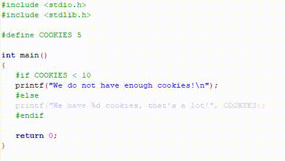

# Macros and Preprocessing
Up until this tutorial, we've been looking at all these new keywords and ways to create code. But something we haven't yet covered is something we've seen a dozen times by now: **Macros** and **preprocessing directives**.

These concept backing these words are not as complex as they sound. They're defined as such:
- **Preprocessor Directive**: Essentially a command in C (beginning with a #) that is executed by C's Preprocessor during the code's compilation.
- **Macro**: A predefined symbol with or without a value or parameters.

## Preprocessor Directives
Say, a preprocessor directive sounds familiar. Where have we already seen those? With the ``#include`` statement, of course! That is a directive that tells C to link certain files (typically **header** files) to the file they are being in declared in. This allows the current file to use functions, constants, and so forth from that file.

Below, the more relevant and important preprocessor directives have been organized into a table for your convenience:

Directive | Description
:---: | :---:
\#include | Includes a header file as part of the file's accessible code.
\#pragma | Can be used to interact with the compiler by using special commands.
\#error | Prints an error message of your choice to the console. This allows you to create custom errors before your program runs!
\#define | Creates a macro with a name and a value.
\#undef | Removes a macro with the given name.
\#ifdef | Checks to see if a macro of the given name exists. Similar to an if statement, but specific to checking whether a macro exists.
\#ifndef | Checks to see if a macro of the given name does NOT exist. Similar to an if statement, but specific to checking whether a macro does NOT exist.
\#endif | Signifies to C's preprocessor that we are done with certain preprocessor logic. Should only accompany a \#if, \#ifdef, or a \#ifndef.
\#if | Can be used to check macro values under certain conditions. Similar to if statement.
\#elif | Can be used to check macro values under certain conditions. Similar to an else-if statement.
\#else | Can be used in a manner similar to the else statement along with #if and #elif.

For simplicity reasons, #pragma and #error will not be given examples for. In this portion, it is the last three directives that should be emphasized a little further beyond their descriptions.

Consider this GIF (wow, this is a new one!):



Neat, huh? Now, one thing to emphasize with these is that these are **NOT**, repeat, **NOT** the same as the condition statements. These don't execute either/or ``printf`` based on the ``COOKIES`` macro's value. Remember that preprocessor directives are handled before compile time. What's actually going on here is that, if COOKIES is less than ``10``, then the second ``printf`` **won't even be part of the code**. That's right. It'll be outright removed before the code is compiled. Hence why it is greyed out.

This is good! Remember that C can have code that is specific to certain platforms. So we can, in theory, check what platform we're on (Windows or Linux, for example) and scrap code at the last second in favor of code that is **safe** to use on that platform. This allows C developers to share the same code, but when they build it on their separate, different operating systems, it'll run without fail. 

## Macros
A macro, on the other hand, is something new here. Suppose we have the following program:
```c
#include <stdio.h>
#include <stdlib.h>

int main() {
    printf("PI is %lf", 3.141592653);
    return 0;
}
```
Here, π is quite a long and exhausting number to type out. Now imagine doing this multiple times throughout the program!

### #define Directive
What's more troublesome is, what if we made a mistake in typing π? Well, then we would have to go back to each and every single little mistake to correct it, which is rather frustrating. So, instead of doing that, what we can do is this:
```c
#include <stdio.h>
#include <stdlib.h>

#define PI 3.141592653 // Define a constant PI here.

int main() {
    printf("PI is %lf", PI); // During compilation, PI is replaced with that number above.
    return 0;
}
```
Now if we had an error in typing π, we can fix it in that one spot, and it will be fixed everywhere throughout the file!

Generally, a macro created using the ``#define`` preprocessor directive has the following format:

``#define (YOUR_VARIABLE_NAME_HERE) (SOME_VALUE_HERE)``

In our program above, if we wanted to "undo" the creation of that ``PI`` constant, we would do ``#undef PI`` immediately after it is declared.

### #ifndef Directive
What if PI was already defined, and had some other value? What if C already defined it, but instead made it ``3.14``, excluding the additional decimal numbers we added? We would want to check if C's built-in definition of ``PI`` existed before creating our own using the ``#ifndef`` (if not defined) directive:
```c
#include <stdio.h>
#include <stdlib.h>

#ifndef PI
#define PI 3.141592653 // This won't be defined if PI already exists.
#endif

int main() {
    printf("PI is %lf", PI);
    return 0;
}
```
### #ifdef and #undef Directive
Alternatively, what if we DID want to use our version of PI instead? Well, we can first check if the built-in PI already exists. If it does, then we can undefine (using ``#undef``) the built-in one, and define our own:
```c
#include <stdio.h>
#include <stdlib.h>

#ifdef PI // If C's or some version of PI already exists...
#undef PI // Undefine it.
#define PI 3.141592653 // Define our own PI with more precision.
#endif

int main() {
    printf("PI is %lf", PI);
    return 0;
}
```

### Predefined Macros
C offers some built-in macros for us to play around with. Below is a listing of the macros that you can use wherever in any of your files:

| Directive | Usage
:---: | :---:
**\_\_DATE\_\_** | The current date in the format ``MMM DD YYYY`` at the time of compiling the file.
**\_\_TIME\_\_** | The current time in the format ``HH:MM:SS`` at the time of compiling the file.
**\_\_FILE\_\_** | The file's directory location and name as a ``string``.
**\_\_LINE\_\_** | The line number as a ``decimal`` of wherever this macro is used.
**\_\_STDC\_\_** | Has a value of ``1`` when and only when the compiler complies with the ANSI standard for text.

Here's an example where the file name is ``main.c``:
```c
#include <stdio.h>
#include <stdlib.h>

int main() {
    printf("File: %s\n", __FILE__ );
    printf("Date: %s\n", __DATE__ );
    printf("Time: %s\n", __TIME__ );
    printf("Line: %d\n", __LINE__ );
    printf("ANSI: %d", __STDC__ );
 }
```
Which outputs:
```
File: C:\Users\User\CodeBlocks\TestProject\main.c
Date: Oct 28 2019
Time: 20:04:11
Line: 8
ANSI: 1
```


[](https://discord.gg/Sw3npy4)

[Home](https://bvanseg.github.io)