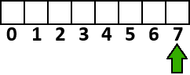
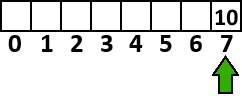
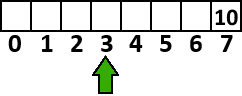

# Pointers (part 2)
We've gone through quite a lot of information with ``pointer``s already. But because of how powerful ``pointer``s are, there is still more to learn with them. In this tutorial, we'll be going over **pointer arithmetic**, as well as demonstrating how you can combine ``pointer``s with loops.

## Pointer Arithmetic
Recalling our arithmetic operators (+, -, *, /, %), we know we can manipulate ``int`` data with said operators to get new results.

But what about ``pointer``s? What happens if we use those operators on them? Well, let's think about it.

A ``pointer`` is an address. So, if we do ``pointer++``, it should move the address forward. And the same goes for if we move it backwards with ``pointer--``.

However, it's a little more specific than that. It doesn't just move the ``pointer`` forward or backward a **single** address (aka a single byte). It moves the ``pointer`` back X number of addresses, where X is the number of bytes of the ``type`` the ``pointer`` represents.

Suppose we have the following:

``int* pointer = malloc(4);``

Alright, just allocating 4 bytes to an ``int`` ``pointer``. Nothing out of the ordinary, right?

Suppose the address of our new pointer that ``malloc`` gives us is ``7`` out of the entire RAM:



Then suppose we put the number ``10`` into that address using:

``*pointer = 10;``



And then we want to move our pointer back one ``int`` (4 bytes) by doing ``pointer--;``:



Some things to note here:
- The value we put at address ``7`` is still left there, even though we moved our ``pointer`` back 4 addresses/bytes.
- If we do ``*pointer`` **again**, it will try to get the value at addresses ``3-6``, **NOT** addresses ``7-10`` as C had given us. So we'd need to do ``*pointer = (some number);`` in order to set the value at the addresses of ``3-6`` (since it's an ``int`` and uses 4 bytes to represent 1 value).
- We could still technically get address ``7`` again by doing ``pointer[1]``, but remember. We told C to allocate 4 bytes for us, and it gave us addresses ``7-10`` to hold our value. Now we are working outside of that range. So, we are working in uncharted territory. C still thinks we are working with the addresses it gave us, but in actuality, we have not. So be warned that working outside of the range of addresses from which you asked C for is dangerous and can lead to several issues. More on that in upcoming tutorials.
- ``++`` and ``--`` Only move  the ``pointer`` backwards/forwards based on the size of the type of the ``pointer`` (``int``, in this case). So if you want to move through addresses one by one, you could do ``pointer += 1;`` or ``pointer -= 1;``, which would move our ``pointer`` up there from ``3`` to ``4``. Just be aware that this may break the value of the ``pointer``, since you are now using different bytes (and therefore, it may be a different value when you dereference the ``pointer``).

## Looping Pointers
So ``pointer``s are like ``array``s, huh? Well we know we can loop ``array``s, so let's see about looping ``pointer``s!

Below, we have a casual ``for`` loop that loops through a ``pointer`` called ``bytes`` with a size of ``5`` bytes allocated to it. As we loop, we first set the value of the first element of the ``pointer`` (a ``char/byte``) equal to ``i``, print it out, then adjust the pointer's position to the next address:

```c
#include <stdio.h>
#include <stdlib.h>

int main() {

    char* bytes = malloc(5);

    for(int i = 0; i < 5; i++) {
        *bytes = i;
        printf("%d\n", *bytes);
        bytes += 1;
    }

    return 0;
}
```
Which outputs:
```
0
1
2
3
4
```

You could also use ``i`` to access the ``pointer`` as if it were an ``array``. As a challenge, see if you can allocate space for 10 ``int``s, and set each ``int`` within the ``pointer`` to a value! **(Hint: Remember the difference between **moving** the pointer (shown above) and actually accessing its elements!).**


[](https://discord.gg/Sw3npy4)

[Home](https://bvanseg.github.io)